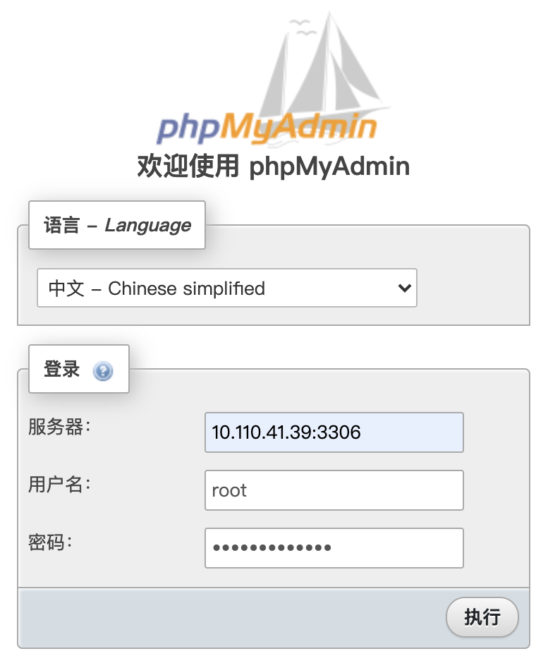

# Multiarch Bigdata Docker

## 目录
1. [简单介绍](#简单介绍)
1. [单节点部署](#单节点部署)
1. [多节点集群部署](#多节点集群部署)
1. [各组件简易教程](#各组件简易教程)
	1. [phpmyadmin](#phpmyadmin)

## 简单介绍
目前支持的系统架构 `amd64`、`arm/v7`、`arm64`，树莓派上也可以运行~

在多种架构下，统一大数据环境部署，包括一下组件：
* [x] redis
* [x] kafka
* [x] kafkamanager
* [x] mysql
* [x] phpmyadmin
* [ ] hive
* [ ] spark
* [ ] flink
* [ ] hue
* [ ] sqoop
* [ ] hbase
* [ ] mongodb
* [ ] mongoexpress
* [ ] zeppelin
* [ ] postgres

## 单节点部署

第一步，修改 `.env.local` 文件的 `ZOO_CONNECT` 参数的 IP 为自己本地的 IP。

第二步，重命名文件 `.env.local` 为 `.env`。

```shell script
mv .env.local .env
```

第三步，启动容器

```shell script
docker-compose up -d
```

## 多节点集群部署

假设部署 3 台机器，其环境变量文件分别是 `.env.cluster1`、`.env.cluster2` 和 `.env.cluster3`。

第一步，先添加以下 6 个端口到入站规则里：1099、2181、2888、3888、9000、9092、6379，或者关闭防火墙（不太建议）。3 台机器都要添加。

第二步，对于 3 台机器，分别修改其环境变量 `.env.clusterN` 里的参数：

* `MACHINE_ID`：机器的唯一 ID，不能重复。
* `SERVER_IP`：机器的 IP 地址，不能重复，也不能是 0.0.0.0/127.0.0.1/localhost 等。
* `ZOO_SERVERS`：server.x 的值为 0.0.0.0:2888:3888（这里的 x 就是上面的 MACHINE_ID 对应的数字），其他 server.x 的值为对应的 IP:2888:3888。
* `ZOO_CONNECT`：所有机器的 IP:2181，用半角逗号分隔开。
* `KAFKA_MANAGER_USERNAME`：kafka manager 应用账号
* `KAFKA_MANAGER_PASSWORD`：kafka manager 应用密码
* `MYSQL_ROOT_PASSWORD`：mysql root 用户的密码

第三步，重命名环境变量文件 `.env.clusterN` 为 `.env`。

```shell script
mv .env.cluster1 .env  # 将机器 1 的 .env.cluster1 重命名为 .env
mv .env.cluster2 .env  # 将机器 2 的 .env.cluster2 重命名为 .env
mv .env.cluster3 .env  # 将机器 3 的 .env.cluster3 重命名为 .env
```

第四步，运行容器：

```shell script
docker-compose up -d
```

🔥 **注意**：如果修改过 `.env` 或 `docker-compose.yml` 两个文件后，导致无法启动 kafka，只需要把当前目录下的 kafka 目录删掉，再重新运行 `docker start kafka` 就可以了。redis、zookeeper 亦如此。

### phpmyadmin

注意服务器栏不能是 localhost 或 127.0.0.1，而要是真实 IP
